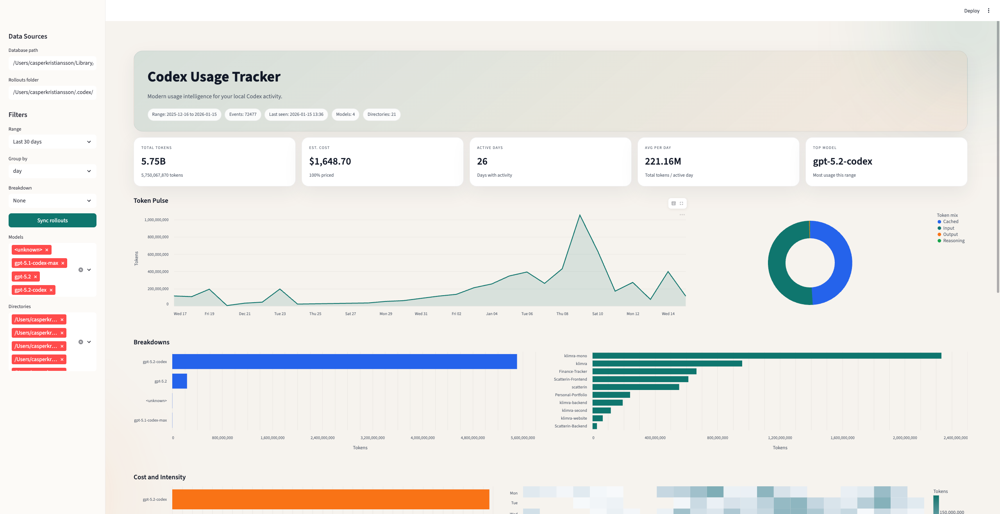

# Codex Usage Tracker

Codex Usage Tracker is a local-first tracker for OpenAI Codex CLI usage. It ingests Codex rollout JSONL files and stores token usage plus metadata in SQLite for reporting, exporting, and a local dashboard.

## Install (One Command)

Builds the bundled UI + backend and installs a `codex-track` binary on your PATH:

```bash
./scripts/install.sh
codex-track web
```

Default install locations:

* Bundle: `~/.codex-usage-tracker`
* Binary: `~/.local/bin/codex-track`

Make sure `~/.local/bin` is on your PATH.

Override with:

```bash
CODEX_USAGE_INSTALL_DIR=/path/to/install \
CODEX_USAGE_BIN_DIR=/path/to/bin \
./scripts/install.sh
```



## Overview

* **Primary goal:** Track and summarize Codex CLI token usage locally.
* **Storage:** SQLite (local).
* **Ingestion sources:** Codex rollout JSONL files (default), plus optional CLI output logs and app-server JSON-RPC logs.
* **Interfaces:** CLI (`codex-track`) and a local Next.js dashboard (`codex-track web`).

## Features

* Ingests `rollout-*.jsonl` under `~/.codex/sessions/**` and extracts usage events (TokenCount and related events).
* Stores data locally in SQLite, with **incremental ingestion** (skips unchanged files based on mtime/size).
* Generates **daily/weekly/monthly** summaries and breakdowns by **model**, **directory**, or **session**.
* Exports raw events to **JSON** or **CSV**.
* Shows the latest usage snapshot.
* Runs a local Next.js dashboard via a CLI command.

## How It Works

### Data sources (ingestion paths)

* **Rollout JSONL files (default ingestion source):**
  `~/.codex/sessions/**/rollout-*.jsonl`

* **CLI output logs (explicit ingestion):**
  `codex-track ingest-cli --log <path>`
  or from stdin: `codex-track ingest-cli --log -`

* **App-server JSON-RPC logs (explicit ingestion):**
  `codex-track ingest-app-server --log <path>`
  or from stdin: `codex-track ingest-app-server --log -`

### Auto-ingestion behavior

These commands **auto-ingest rollout files** before producing output:

* `codex-track report`
* `codex-track export`
* `codex-track status`
* `codex-track web` (or `codex-track ui`)

For `codex-track report`, time flags affect ingestion scope:

* `--last` / `--from` / `--to` limit ingestion to **files modified in that range**.
* `--today` is **local midnight → now**.

## Requirements

* Python **>= 3.10**
* Node.js (for the packaged UI runtime)
* pnpm (for building the UI during install)

## Quickstart

### 1) Report (auto-ingests rollouts)

Show today’s usage (local midnight → now):

```bash
codex-track report --today
```

Summarize the last 7 days, grouped by day, broken down by model:

```bash
codex-track report --last 7d --group day --by model
```

Output as JSON instead of a table:

```bash
codex-track report --today --format json
```

### 2) Export raw events (auto-ingests rollouts)

Export raw events as CSV:

```bash
codex-track export --format csv --out events.csv
```

### 3) Status snapshot (auto-ingests rollouts)

```bash
codex-track status
```

### 4) Launch the local dashboard (auto-ingests rollouts)

```bash
codex-track web
```

Run on a custom port and don’t open a browser:

```bash
codex-track web --port 3001 --no-open
```

## CLI Reference

The bundled CLI is named: **`codex-track`**

| Command                         | Purpose                                                         | Key flags                                                                                                                                                                                               |
| ------------------------------- | --------------------------------------------------------------- | ------------------------------------------------------------------------------------------------------------------------------------------------------------------------------------------------------- |
| `codex-track report`            | Generate summaries/breakdowns (auto-ingests rollouts)           | `--db`, `--rollouts`, `--last <Nd|Nh>`, `--today`, `--from <YYYY-MM-DD or ISO>`, `--to <YYYY-MM-DD or ISO>`, `--group day|week|month`, `--by model|directory|session`, `--format table|json|csv` |
| `codex-track export`            | Export raw events (auto-ingests rollouts)                       | `--db`, `--rollouts`, `--format json|csv`, `--out <path>`                                                                                                                                              |
| `codex-track status`            | Print latest usage snapshot (auto-ingests rollouts)             | `--db`, `--rollouts`                                                                                                                                                                                    |
| `codex-track web`               | Launch local Next.js dashboard from `ui/`                       | `--db`, `--rollouts`, `--port`, `--no-open`                                                                                                                                                             |
| `codex-track ui`                | Alias for `codex-track web`                                     | `--db`, `--rollouts`, `--port`, `--no-open`                                                                                                                                                             |
| `codex-track ingest-cli`        | Parse Codex CLI logs for `/status` and final “Token usage” line | `--db`, `--log <path or ->`                                                                                                                                                                             |
| `codex-track ingest-app-server` | Parse app-server JSON-RPC logs and write timings/metadata       | `--db`, `--log <path or ->`                                                                                                                                                                             |
| `codex-track clear-db`          | Delete the local DB (prompts unless `--yes`)                    | `--db`, `--yes`                                                                                                                                                                                         |

## Data Stored and Privacy

### What is stored (high level)

SQLite tables include:

* `meta`, `ingestion_files`
* `events` (token usage + status snapshots + other event types; includes token counts, context window, rate/limit info, model, directory, session id, codex version, timestamps, source)
* `sessions` (session metadata like cwd, originator, cli version, git info)
* `turns` (turn metadata: model, cwd, sandbox/policy flags, truncation, reasoning flags)
* `activity_events` (counts of message/tool activity types)
* `content_messages` (full text from rollout events and response items)
* `tool_calls` (tool arguments and outputs from response items)
* `app_turns` (timings from app-server turn started/completed)
* `app_items` (timings + command/tool metadata from app-server item events)
* `weekly_quota_estimates` (derived weekly quota estimates)

### Privacy note: documentation conflict

Some documentation claims **“no prompt/response content is stored,”** but the actual data model includes `content_messages` and `tool_calls`, which store **message text** and **tool call inputs/outputs** from rollouts.

If you are operating under a “no content stored” assumption, treat this as a **privacy-impacting discrepancy** and review how/where you run ingestion and where the resulting SQLite DB is stored and backed up.

## Configuration

### Default paths

* **Default rollouts dir:** `~/.codex/sessions`

* **Default DB path:**

  * **macOS:** `~/Library/Application Support/codex-usage-tracker/usage.sqlite`
  * **Linux:** `~/.local/share/codex-usage-tracker/usage.sqlite`

Overrides:

* Override DB path: `--db /path/to/usage.sqlite`
* Override rollouts dir: `--rollouts /path/to/sessions`

### Timezone

Reports and timestamps use **`Europe/Stockholm`** as the local timezone.

### Weekly quota estimates

`codex-track report` may compute a weekly quota estimate based on the **last completed week**.

* Default weekly reset: **Thursday at 09:15 (Europe/Stockholm)**
* Override reset time via environment variable: `CODEX_USAGE_WEEKLY_RESET`

### Dashboard environment variables

When provided, `codex-track web` (or `codex-track ui`) sets:

* `CODEX_USAGE_DB`
* `CODEX_USAGE_ROLLOUTS`

## Pricing and Cost Estimation

Reports estimate cost using built-in pricing **per 1M tokens**:

| Model               | Input | Cached input | Output |
| ------------------- | ----: | -----------: | -----: |
| `gpt-5.2`           | 1.750 |        0.175 | 14.000 |
| `gpt-5.1-codex-max` |  1.25 |        0.125 |  10.00 |
| `gpt-5.1-codex`     |  1.25 |        0.125 |  10.00 |
| `gpt-5.2-codex`     |  1.75 |        0.175 |  14.00 |

## Development

Run tests:

```bash
python -m unittest discover -s tests
```

## Packaging (local, macOS)

Build a self-contained `dist/` bundle (UI standalone + backend sources) that runs without installing `pnpm` deps or the Python package:

```bash
./scripts/package.sh
```

Then run the packaged CLI:

```bash
./dist/codex-track web
```

## Notes

* OS support is documented for **macOS** and **Linux** default DB paths only; a Windows default path is not specified here.
* The “no prompt/response content stored” claim conflicts with the presence of `content_messages` and `tool_calls`. If this matters for your environment, validate the current behavior by inspecting the SQLite DB contents after ingestion.
